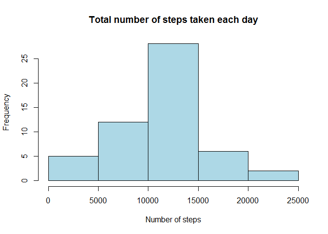
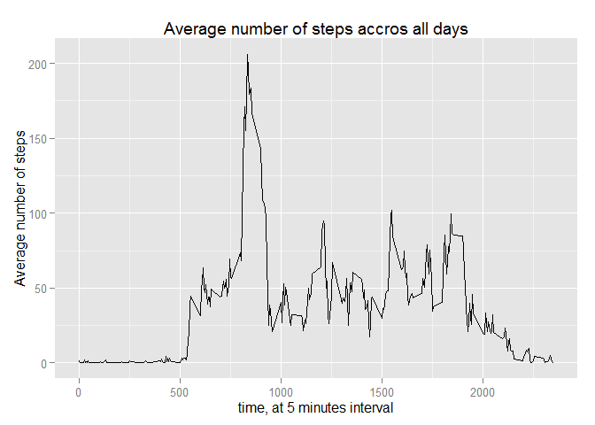
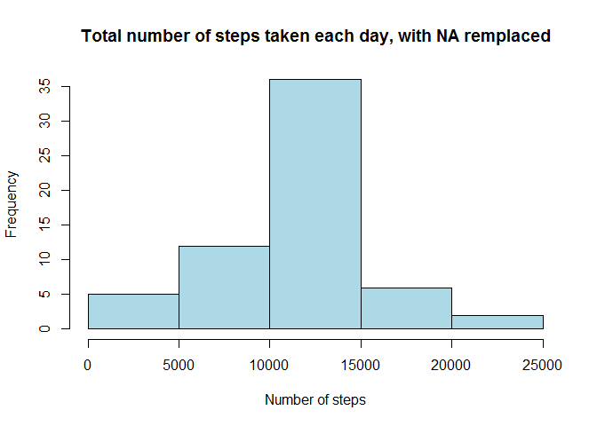
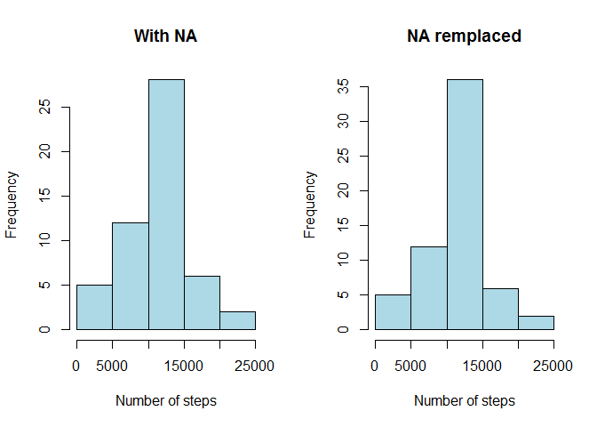
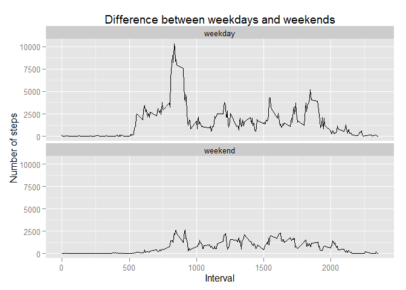

# Reproducible Research: Peer Assessment 1

## Loading and preprocessing the data


```r
## decompress file and load dataset into a variable
unzip("activity.zip")
rawData <- read.csv("activity.csv")
## remove file after loading it
file.remove("activity.csv")
```

```
## [1] TRUE
```


```r
## have a quick look at the data
head(rawData)
```

```
##   steps       date interval
## 1    NA 2012-10-01        0
## 2    NA 2012-10-01        5
## 3    NA 2012-10-01       10
## 4    NA 2012-10-01       15
## 5    NA 2012-10-01       20
## 6    NA 2012-10-01       25
```

```r
summary(rawData)
```

```
##      steps                date          interval     
##  Min.   :  0.00   2012-10-01:  288   Min.   :   0.0  
##  1st Qu.:  0.00   2012-10-02:  288   1st Qu.: 588.8  
##  Median :  0.00   2012-10-03:  288   Median :1177.5  
##  Mean   : 37.38   2012-10-04:  288   Mean   :1177.5  
##  3rd Qu.: 12.00   2012-10-05:  288   3rd Qu.:1766.2  
##  Max.   :806.00   2012-10-06:  288   Max.   :2355.0  
##  NA's   :2304     (Other)   :15840
```


```r
## Check date format
class(rawData$date)
```

```
## [1] "factor"
```

```r
## We need to convert the date colum as Date type
rawData[, "date"] <- as.Date(rawData[, "date"], "%Y-%m-%d")
## Check interval format
class(rawData$interval)
```

```
## [1] "integer"
```

```r
## Check steps format
class(rawData$steps)
```

```
## [1] "integer"
```


```r
## Load data.table package and convert to data table for easier manipulations
library(data.table)
dt <- data.table(rawData)
## then we remove the unused object to release memory
rm(rawData)
```


## What is mean total number of steps taken per day?
### First we calculate the total number of steps taken per day

```r
## For this part we can ignore the missing values
## we store the result of the group in a variable since it will be reused later
subset.ignoredNA <- dt[complete.cases(dt), .(steps.sum = sum(steps)), by=date]
## then display the results
subset.ignoredNA
```

```
##           date steps.sum
##  1: 2012-10-02       126
##  2: 2012-10-03     11352
##  3: 2012-10-04     12116
##  4: 2012-10-05     13294
##  5: 2012-10-06     15420
##  6: 2012-10-07     11015
##  7: 2012-10-09     12811
##  8: 2012-10-10      9900
##  9: 2012-10-11     10304
## 10: 2012-10-12     17382
## 11: 2012-10-13     12426
## 12: 2012-10-14     15098
## 13: 2012-10-15     10139
## 14: 2012-10-16     15084
## 15: 2012-10-17     13452
## 16: 2012-10-18     10056
## 17: 2012-10-19     11829
## 18: 2012-10-20     10395
## 19: 2012-10-21      8821
## 20: 2012-10-22     13460
## 21: 2012-10-23      8918
## 22: 2012-10-24      8355
## 23: 2012-10-25      2492
## 24: 2012-10-26      6778
## 25: 2012-10-27     10119
## 26: 2012-10-28     11458
## 27: 2012-10-29      5018
## 28: 2012-10-30      9819
## 29: 2012-10-31     15414
## 30: 2012-11-02     10600
## 31: 2012-11-03     10571
## 32: 2012-11-05     10439
## 33: 2012-11-06      8334
## 34: 2012-11-07     12883
## 35: 2012-11-08      3219
## 36: 2012-11-11     12608
## 37: 2012-11-12     10765
## 38: 2012-11-13      7336
## 39: 2012-11-15        41
## 40: 2012-11-16      5441
## 41: 2012-11-17     14339
## 42: 2012-11-18     15110
## 43: 2012-11-19      8841
## 44: 2012-11-20      4472
## 45: 2012-11-21     12787
## 46: 2012-11-22     20427
## 47: 2012-11-23     21194
## 48: 2012-11-24     14478
## 49: 2012-11-25     11834
## 50: 2012-11-26     11162
## 51: 2012-11-27     13646
## 52: 2012-11-28     10183
## 53: 2012-11-29      7047
##           date steps.sum
```
### Then we make an histogram of the total number of steps taken each day

```r
hist(subset.ignoredNA$steps.sum, main="Total number of steps taken each day", xlab="Number of steps", col="lightblue")
```

 

### Finaly, we calculate the median and the mean of the total number of steps taken per day

```r
## this is the mean 
mean(subset.ignoredNA$steps.sum)
```

```
## [1] 10766.19
```

```r
## and this is the median
median(subset.ignoredNA$steps.sum)
```

```
## [1] 10765
```

## What is the average daily activity pattern?
### Make a time series plot of the 5-minute interval (x-axis) and the average number of steps taken, averaged across all days (y-axis)

```r
## Get average number of step by interval
subset.avg <- dt[complete.cases(dt), .(steps.mean = mean(steps)), by=interval]
## use ggplot2 to draw the time series plot
library(ggplot2)
qplot(x=interval, y=steps.mean, data=subset.avg, geom="line", xlab="time, at 5 minutes interval", ylab="Average number of steps", main="Average number of steps accros all days")
```

 

### Which 5-minute interval, on average across all the days in the dataset, contains the maximum number of steps?

```r
subset.avg[steps.mean==max(subset.avg$steps.mean), ]
```

```
##    interval steps.mean
## 1:      835   206.1698
```
The Interval 835 has the higher number of steps.

## Imputing missing values

### Note that there are a number of days/intervals where there are missing values (coded as NA). The presence of missing days may introduce bias into some calculations or summaries of the data.

#### Here, we calculate and report the total number of missing values in the dataset

```r
## count the number of NA
sum(is.na(dt$steps))
```

```
## [1] 2304
```

There is 2304 NA's in the dataset

#### We are going to use the following strategy for dealing with NA :
#### Using the average we calculated on interval, with are going to replace NA with the value of the average of the interval

```r
## Create a copy of the dataset
fullSet <- dt

## remplace NA with the average of the interval, not optimal because it is slow...
for(i in 1:nrow(fullSet)) {
        if(is.na(fullSet[i,]$steps)){
                fullSet[i, ]$steps <- as.integer(round(subset.avg[interval == fullSet[i, ]$interval, ]$steps.mean))
        }
}

## confirm we have no more NA
sum(is.na(fullSet$steps))
```

```
## [1] 0
```

```r
## generate new dataset with NA remplaced
subset.replacedNA <- fullSet[ , .(steps.sum = sum(steps)), by=date]

hist(subset.replacedNA$steps.sum, main="Total number of steps taken each day, with NA remplaced", xlab="Number of steps", col="lightblue")
```

 

```r
## Look at the mean of this new set
mean(subset.replacedNA$steps.sum)
```

```
## [1] 10765.64
```

```r
## and the median
median(subset.replacedNA$steps.sum)
```

```
## [1] 10762
```

### Here is side by the the two histogram, before and after remplacing NA's

```r
par(mfrow = c(1,2))

hist(subset.ignoredNA$steps.sum, main="With NA", xlab="Number of steps", col="lightblue")
hist(subset.replacedNA$steps.sum, main="NA remplaced", xlab="Number of steps", col="lightblue", breaks=5)
```

 

We can conclude that remplacing the NA's did not alter the overal data, both histogram are ressembling


## Are there differences in activity patterns between weekdays and weekends?

```r
## Create a new dataset 
weekdaySet <- fullSet
## start by adding 2 new columns
weekdaySet$weekday <- weekdays(weekdaySet$date)
## create a dayType, set default to weekday, we are going to update it afterward.
weekdaySet$dayType <- c("weekday")
for (i in 1:nrow(weekdaySet)){
        if (weekdaySet$weekday[i] == "Saturday" || weekdaySet$weekday[i] == "Sunday"){
                weekdaySet$dayType[i] <- c("weekend")
        }
}
weekdaySet$dayType <- as.factor(weekdaySet$dayType)

subSet.perDayType <- weekdaySet[, .(steps.sum = sum(steps)), by=list(interval, dayType)]

## Plot the result
qplot(interval, steps.sum, data=subSet.perDayType, geom=c("line"), xlab="Interval",  ylab="Number of steps", main="Difference between weekdays and weekends") + facet_wrap(~ dayType, ncol=1)
```

 
